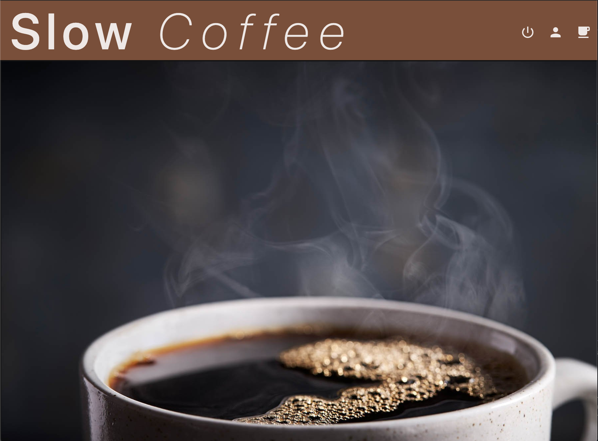
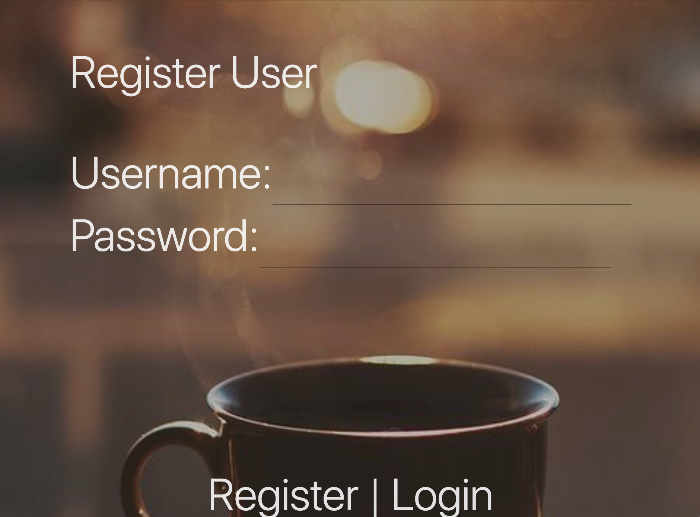
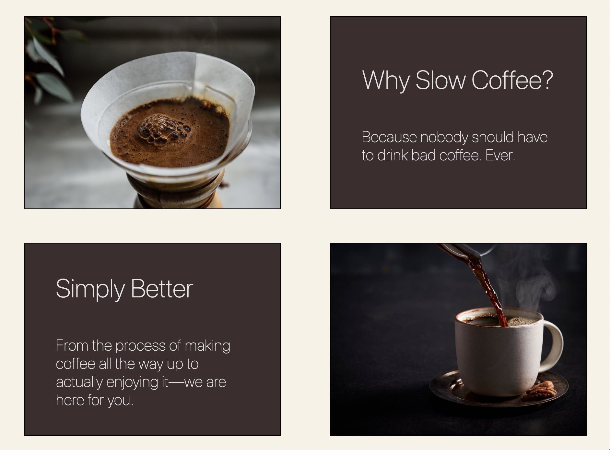
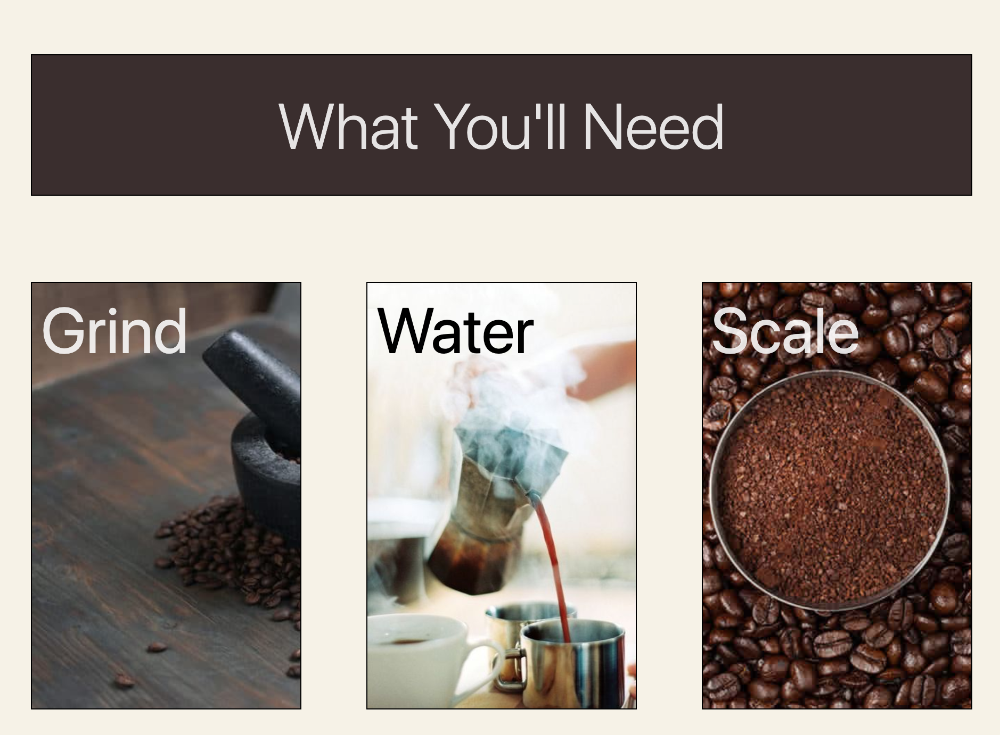
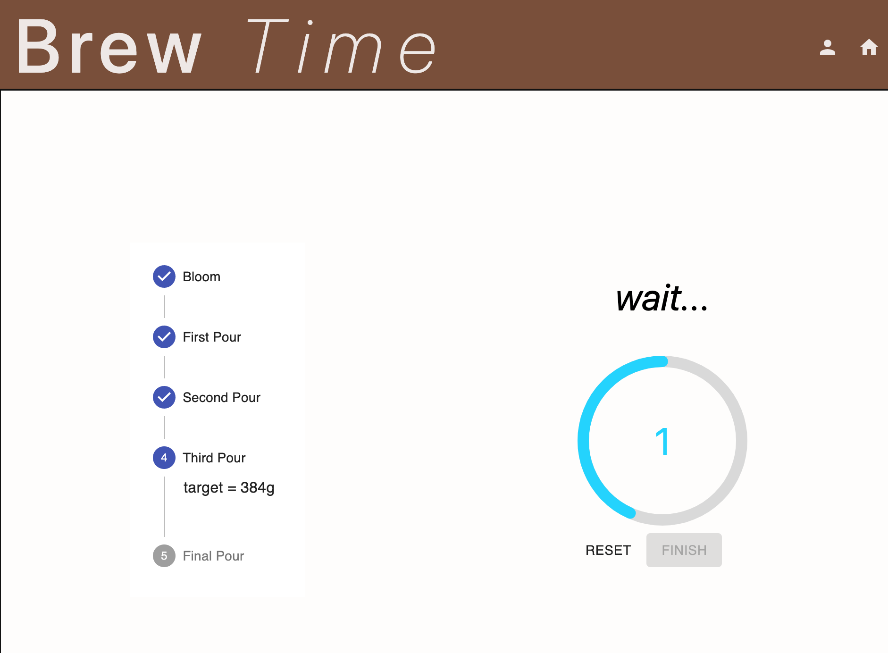
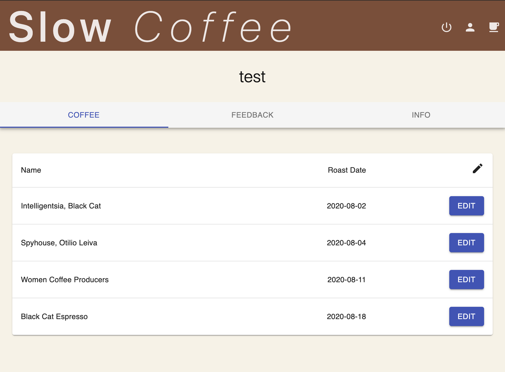

# Slow Coffee 

### By Nicholas Simonelli / 

*Duration: Two Week Sprint*

Slow Coffee is an application built for users that are interested in improving their at home coffee making abilities. This is particularly useful when it comes to two of the most important variables around slow coffee, doseage and timing. Through the use Slow Coffee you will start to get a feel for you taste and preference as you log each successful brew through your own personal feedback section. 


## Screen Shots

**Home Page & Registration**



**About & Learn**



**Brew Interface**


**Profile Page**



## Prerequisites

Before you get started, make sure you have the following software installed on your computer:

- [Node.js](https://nodejs.org/en/)
- [PostrgeSQL](https://www.postgresql.org/)
- [Nodemon](https://nodemon.io/)


## Installation

* Create a database named `prime_app`
* Create all of the tables outlined in the provided database.sql file
* Run `npm install`
* Create a `.env` file at the root of the project and paste this line into the file:
    ```
    SERVER_SESSION_SECRET=superDuperSecret
    ```
    While you're in your new `.env` file, take the time to replace `superDuperSecret` with some long random string like `25POUbVtx6RKVNWszd9ERB9Bb6` to keep your application secure. Here's a site that can help you: [https://passwordsgenerator.net/](https://passwordsgenerator.net/). If you don't do this step, create a secret with less than eight characters, or leave it as `superDuperSecret`, you will get a warning.
* Start postgres if not running already by using `brew services start postgresql`
* Run `npm run server`
* Run `npm run client`


## Application

1. Creat an account with Slow Coffee and proceed to scroll through the home page.
2. Once you are ready you may hit the start button to proceed to setup.
3. Here you will decide how much coffee you would like to make and will be prompted with some brief instruction.
4. After everything has been prepared, follow the brew prompts until complete.
5. Check out the feedback section but only after you have enjoyed your great tasting coffee


## Technologies Used

* React.js
* React-redux
* React countdown timer
* Sagas
* Node.js
* Express.js
* PostgreSql


## Acknowledgements

Thank you to Prime Academy for providing me with the knowledge, support, and skills necessary to build this application. Special shoutout to my lead instructor, Mary, and the Paxos cohort, Bird Up! 